# HMS - Hospital Management System

HMS is a full-scale, desktop-based Hospital Management Information System (HMIS) built in Java. It is designed as a modular, data-driven healthcare platform that replaces fragmented hospital workflows with a centralized system for managing patients, staff, resources, and hospital operations.

The system follows a layered architecture combining object-oriented backend design, service-level business logic, and a frontend-inspired page-based UI structure.

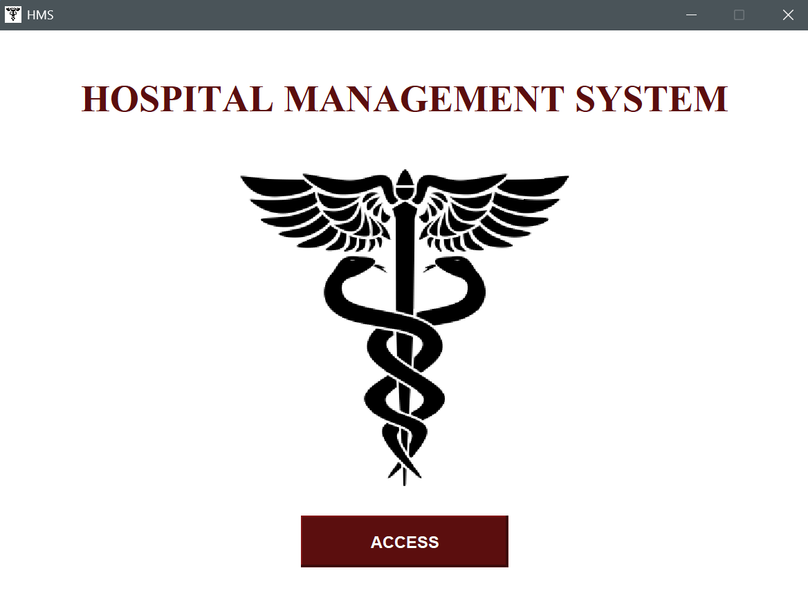

---

## 🛠️ Tech Stack

- **Language:** Java (JDK 8+)
- **UI Framework:** Java Swing
- **Architecture Style:** Layered OOP System with Page-Based UI Design
- **Storage:** File-based persistence (custom flat-file system)
- **Paradigm:** Object-Oriented Programming (OOP)

---

## 🚀 Key Features

### 🏥 Patient & Staff Management
Centralized system for managing patients, doctors, nurses, and their full hospital lifecycle including registration, updates, and tracking.
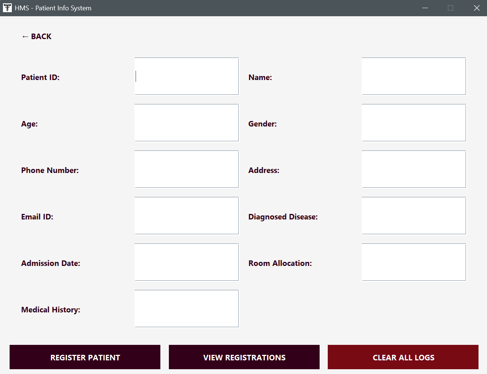

### 📅 Appointment System
Handles scheduling, rescheduling, and linking patients with doctors and departments.

### 🛏️ Bed & Department Monitoring
Tracks ICU and general bed availability in real time, helping manage hospital capacity.
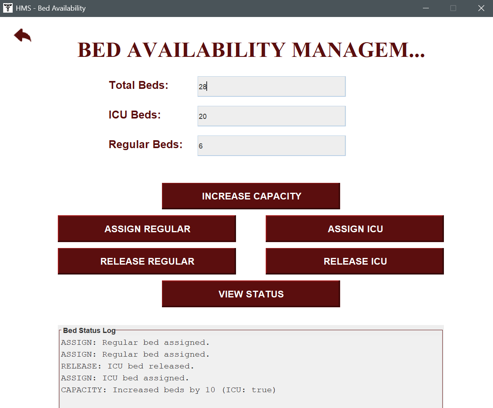
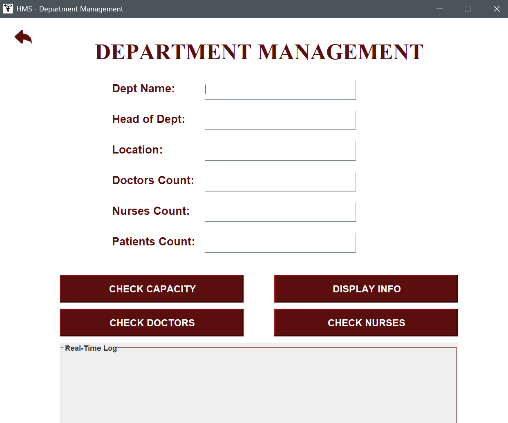

### 🚑 Ambulance Dispatch System
Manages ambulance availability, assignments, and emergency response logs.
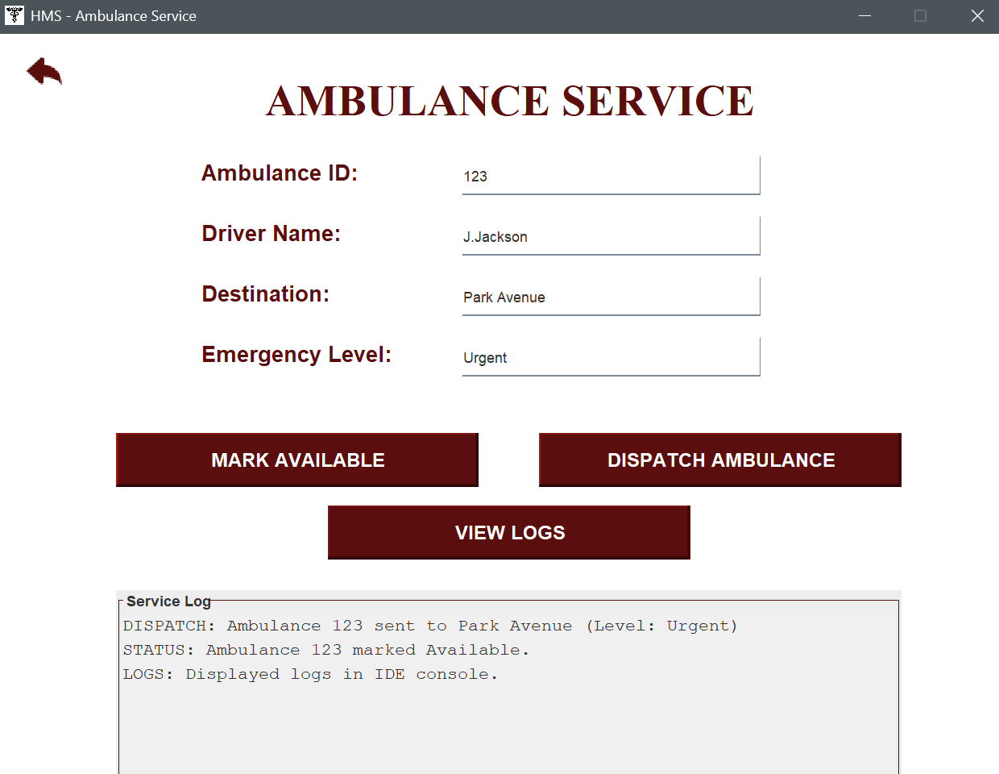

### 💊 Pharmacy Module
Handles medication inventory, stock tracking, and pharmaceutical operations.
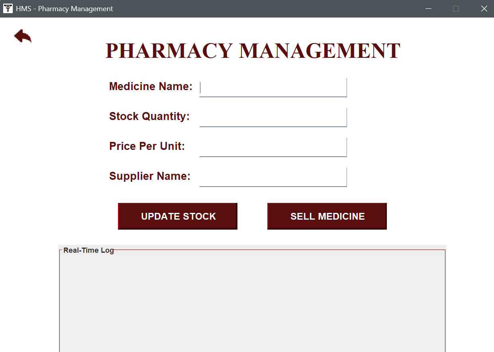

### 🧾 Billing & Revenue Tracking
Aggregates hospital financial data and generates monthly revenue insights.
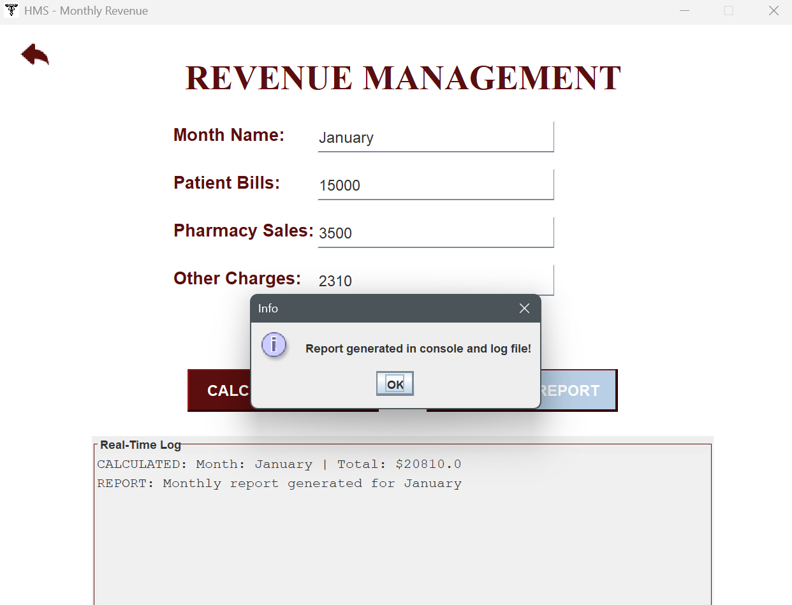

### ⚰️ Incident & Death Records
Maintains structured logs of critical incidents and mortality records for administrative reporting.

### 🧑‍⚕️ Equipment Management
Tracks hospital equipment status, location, and maintenance lifecycle.
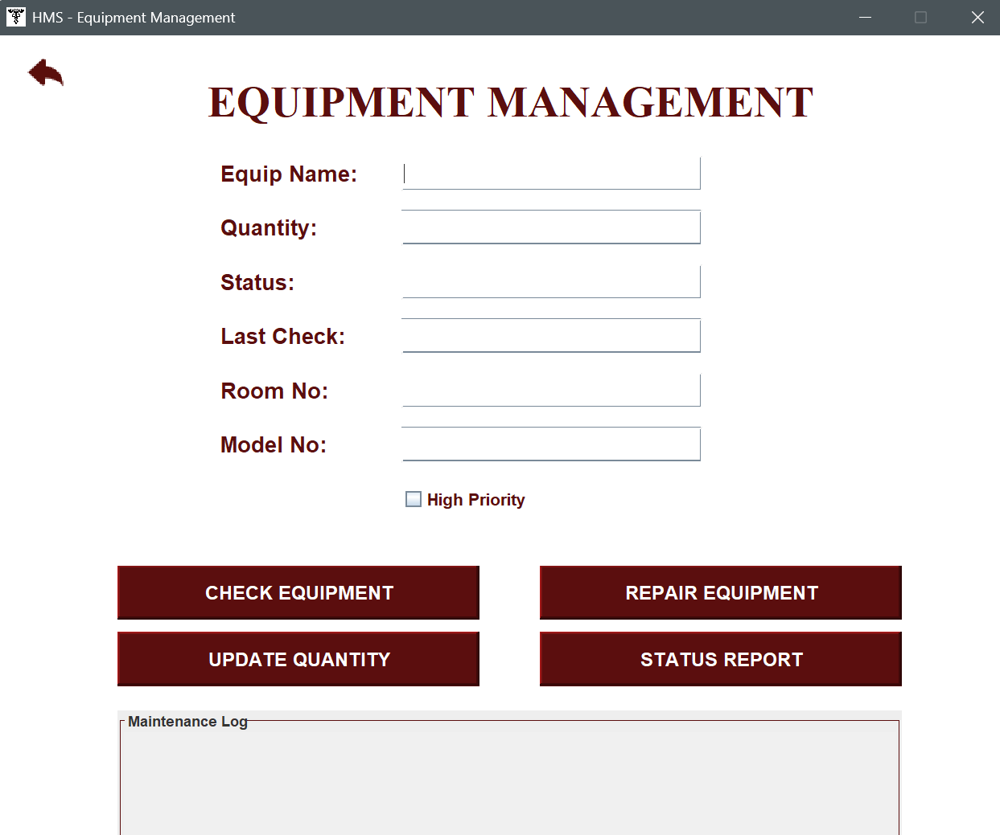

---

## 🏗️ System Architecture Overview

HMS is built using a multi-layer architecture:

### 1. Core Domain Layer (OOP Model)
This layer defines the hospital’s real-world entities using object-oriented principles:

- `Person` (base class)
- `Patient`
- `Doctor`
- `Nurse`
- `Department`
- `Equipment`
- `Appointments`
- `Pharmacy`
- `Death Toll`
- `Bed Availability`

This layer forms the **data backbone** of the entire system using inheritance, association and encapsulation.

---

### 2. Service / Logic Layer
This layer handles core operational workflows and business rules:

- `AmbulanceService` → emergency dispatch logic
- `DischargePatients` → patient exit processing
- `MonthlyRevenue` → financial aggregation engine
- `RevenuePage` → bridge between UI and financial logic

This ensures separation between **data models and system behavior**.

---

### 3. UI Layer (Frontend)
The application uses a **page-based UI structure**, similar in concept to frontend frameworks, where each feature is isolated into its own screen/module.

#### Authentication & Navigation
- `LoginPage` : an admin login page
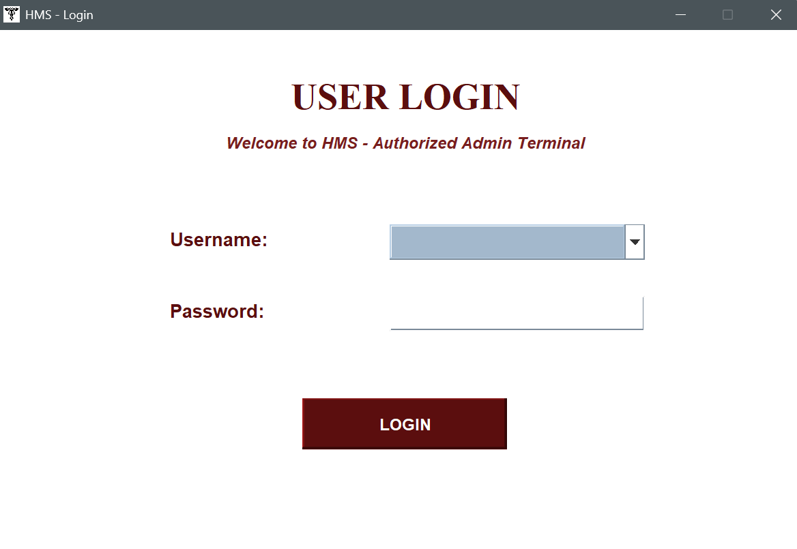
- `FrontAccessPage` : a page where user is given a choice to choose between features (eg. Ambulance Service, Patient Info, etc)
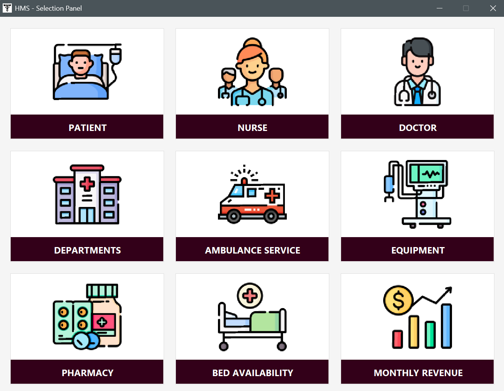
- `SecondPage` : a page where further features are given in corelation to the patient specifcally
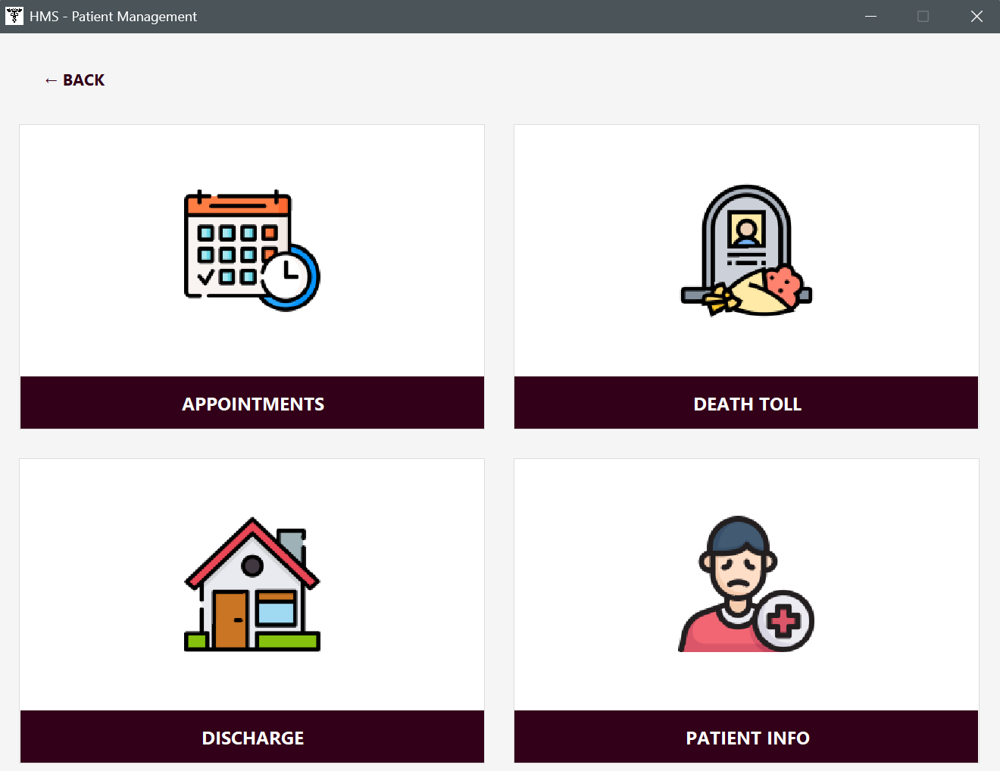

#### Core Operational Pages
- `PatientPage`
- `PatientInfoPage`
- `DoctorPage`
- `NursePage`
- `DepartmentPage`

#### Hospital Operations Modules
- `AppointmentsPage`
- `BedAvailabilityPage`
- `EquipmentPage`
- `PharmacyPage`
- `AmbulancePage`
- `DischargePage`
- `DeathTollPage`

This design creates a **modular UI ecosystem**, improving maintainability and scalability.

---

### 4. Persistence Layer (File-Based Storage)
The system uses lightweight file-based storage to simulate a database:

- `patients`
- `doctors`
- `nurses`
- `appointments`
- `beds`
- `equipment`
- `ambulance_log`
- `death_toll`

This ensures persistent state across sessions without external dependencies.

---

## 🧠 Engineering Highlights

### 🛡️ Defensive Programming
- Extensive use of `try-catch` blocks to prevent runtime crashes
- Input validation across all modules
- Safe error handling with user-friendly alerts

### 🔒 Data Integrity
- Prevents invalid operations (e.g., overbooking beds, invalid appointments)
- Ensures structured data consistency across modules

### 💾 Persistence Strategy
- Uses append-style file storage
- Prevents overwriting historical records
- Enables simple audit trail simulation

### 🧱 Modular Design Philosophy
- Each feature is isolated into independent page modules
- Core entities separated from UI logic
- Service layer bridges UI and backend operations

### 🖥️ UI Architecture
- Page-based navigation system (frontend-inspired design)
- Each module behaves like an independent screen/component
- Ensures separation of concerns and easier scalability

---

## 💻 How to Run

### Prerequisites
- Java Development Kit (JDK 8 or higher)

### Steps

```bash
git clone https://github.com/your-username/hms.git
cd hms
javac -d bin src/**/*.java
java -cp bin com.hms.Main
